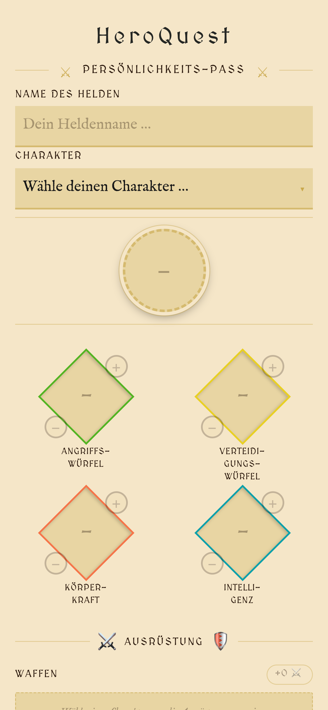
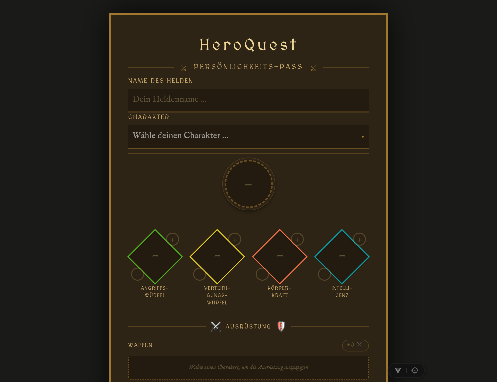

# ⚔️ HeroQuest — Persönlichkeits-Pass

> **Note:** The user interface of this app is entirely in **German**, as it is designed for the German edition of the
> HeroQuest board game.

A mobile-friendly digital character sheet (*Persönlichkeits-Pass*) for the classic fantasy board game **HeroQuest**.
Built with Vue 3, Vite, TypeScript, Pinia, and Tailwind CSS.

🧙 **[Try it out → gaming.waechter.koeln](https://gaming.waechter.koeln)** 🪄

---

## Screenshots

<table>
  <tr>
    <td align="center"><strong>Light mode</strong></td>
    <td align="center"><strong>Dark mode</strong></td>
  </tr>
  <tr>
    <td></td>
    <td></td>
  </tr>
</table>

---

## About the App

This web app lets HeroQuest players manage their hero's character sheet directly in the browser — no paper required. It
covers all the essential information a hero needs during a quest:

- **Hero name & character class** — choose from Barbar, Barde, Druide, Elf, Ritter, Zwerg, or Zauberer
- **Core stats** — Attack Dice (*Angriffswürfel*), Defense Dice (*Verteidigungswürfel*), Body Strength (*Körperkraft*),
  and Intelligence (*Intelligenz*) are pre-filled with class defaults and can be adjusted with the ＋/− buttons
- **Equipment** — equip weapons and armor; bonuses are calculated automatically and reflected in the displayed stats
- **Gegenstände (items)** — equip consumables and magic items; each item shows its ability and bonus label at a glance:
    - 🧪 **Heiltrank** — always restores exactly +4 *Körperkraft* (never above the starting value)
    - 🎲 **Heiltrank (Würfel)** — roll 1d6 and heal exactly that amount (never above the starting value)
    - 💪 **Stärketrank** — +2 *Angriffswürfel* (max. 6)
    - 🛡️ **Immuntrank** — +2 *Verteidigungswürfel* (max. 6)
    - 🔥 **Ring des Feuers** — deflects 2 fire spells; charges are tracked individually
    - 🪄 **Stab der Magie** *(Druide / Zauberer)* — cast twice in a row
    - 💍 **Ring der Magie** *(Druide / Zauberer)* — store a spell on the 1st use, fire it on the 2nd
    - 📿 **Amulett der Weisheit** *(Barbar)* — passive +1 Intelligence
- **Item quantities** — stackable consumables (potions) have an adjustable quantity counter so you can carry multiple
  doses
- **Item charges** — multi-use items (Ring des Feuers, Ring der Magie) track remaining charges with a per-use button
- **Death overlay** — when *Körperkraft* reaches 0 a full-screen overlay appears with a configurable revival point
  selector (capped at the hero's starting *Körperkraft*)
- **End-of-game reset** — the *🏁 Spielende – Werte zurücksetzen* button restores all core stats to their class defaults
  while retaining all equipment and items
- **Persistent state** — all data is automatically saved in the browser via `localStorage`; nothing is lost on a page
  refresh
- **Save & Load** — export the complete character sheet as a `.json` file and reload it at any time (or share it with
  other players)
- **Light & Dark mode** — the UI adapts to the system colour scheme

---

## Characters & Stats

| Character | Avatar | Attack Dice | Defense Dice | Body Strength | Intelligence |
|-----------|:------:|:-----------:|:------------:|:-------------:|:------------:|
| Barbar    |   ⚔️   |      3      |      2       |       8       |      2       |
| Barde     |   📯   |      2      |      2       |       5       |      4       |
| Berserker |   🪓   |      3      |      2       |       7       |      2       |
| Druide    |   🧙   |      1      |      2       |       6       |      4       |
| Elf       | 🧝‍♂️  |      2      |      2       |       6       |      4       |
| Ritter    |   🏰   |      2      |      3       |       7       |      2       |
| Zwerg     |   ⚒️   |      2      |      2       |       7       |      3       |
| Zauberer  |   🪄   |      1      |      2       |       4       |      6       |

> Weapon, armor, and passive item bonuses are applied on top of these base values automatically.

---

## Equipment Reference

### Waffen (Weapons)

| Weapon                  | Bonus | Restriction              | Note                                         |
|-------------------------|:-----:|--------------------------|----------------------------------------------|
| Armbrust                |  +2   | —                        | Ranged weapon                                |
| Breitschwert            |  +2   | Barbar, Berserker        |                                              |
| Dolch                   |  +1   | —                        | Sharp dagger for deadly strikes               |
| Geisterschwert          |  +2   | —                        | Magical sword with secret powers             |
| Handbeil                |  +2   | —                        | Versatile weapon for any situation           |
| Kurzschwert             |  +1   | —                        |                                              |
| Langschwert             |  +1   | —                        | Can also attack diagonally                   |
| Langschwert des Glücks  |  +2   | —                        | Grants additional attack opportunities        |
| Ork-Kurzschwert         |  +1   | —                        | Orcs can be attacked twice in a row          |
| Phantomklinge           |  +3   | —                        | Invisible weapon with phenomenal attack     |
| Stab                    |  +2   | —                        | Long wooden staff; cannot equip shield       |
| Stab des Zauberers      |  +2   | Druide, Zauberer         | Enhances spellcasting power                  |
| Streitaxt               |  +2   | —                        |                                              |
| Telekinese-Stab         |  +2   | Druide, Zauberer         | Enables ranged attacks                       |
| Werkzeug                |  +1   | —                        | Disarm mechanical traps                      |

### Rüstung (Armor)

| Armor              | Bonus | Restriction              |
|--------------------|:-----:|--------------------------|
| Armbrust           |  +1   | —                        |
| Armschutz          |  +1   | —                        |
| Armpanzer          |  +1   | —                        |
| Borins Rüstung     |  +3   | —                        |
| Harnisch           |  +2   | —                        |
| Helm               |  +1   | —                        |
| Kettenhemd         |  +1   | —                        |
| Plattenrüstung     |  +2   | Barbar only              |
| Schild             |  +1   | —                        |

### Gegenstände (Special Items)

#### 🧪 Tränke (Potions & Consumables)

| Item                        | Symbol | Effect                                          | Notes                              |
|-----------------------------|:------:|-----------------------------------------------|-------------------------------------|
| Gegengift                   |   🧪   | +2 *Körperkraft* (never above starting value)   | 1 use                              |
| Geschicklichkeitstrank      |   🏃   | +5 Movement points (temporary)                  | 1 use                              |
| Heiltrank                   |   🧪   | +4 *Körperkraft* (never above starting value)   | Stackable                          |
| Heiltrank (Würfel)          |   🎲   | Roll 1d6 → heal that amount (never above start) | Stackable, requires dice roll      |
| Immuntrank                  |  🛡️   | +2 *Verteidigungswürfel* (max. 6)               | Stackable                          |
| Kampfestrank                |   🥊   | Allows a 2nd roll of combat dice (same enemy)   | 1 use                              |
| Stärketrank                 |   💪   | +2 *Angriffswürfel* (max. 6)                    | Stackable                          |
| Stärkungstrank              |   ⚡   | Roll 2 attack dice × 2 (vs. 2 enemies)         | 1 use                              |
| Wiederherstellungstrank     |   🔄   | +1 *Körperkraft* & +1 Intelligence (never above) | 1 use                              |

#### ✨ Magische Gegenstände (Magic Items & Rings)

| Item                        | Symbol | Effect                                          | Notes                              |
|-----------------------------|:------:|-----------------------------------------------|-------------------------------------|
| Amulett der Weisheit        |   📿   | Permanently +1 Intelligence                     | Passive, Barbar only               |
| Borins Rüstung              |  🛡️   | Legendary armor with enhanced protection        | Passive                            |
| Elixier des Lebens          |   🧴   | Restores all lost *Körperkraft*                 | 1 use                              |
| Fluch der Orks              |   💀   | Summons ork power: 2× attack dice (1 enemy)     | 1 use                              |
| Geweibes Wasser             |   💧   | Restores *Körperkraft* & cures spell poison     | 1 use; +3 ❤️                       |
| Mantel des Zauberers        |  🧥   | Permanently +1 Intelligence                     | Passive, Druide & Zauberer only    |
| Ring der Magie              |   💍   | Store spell (1st use) → fire spell (2nd use)    | 2 charges, Druide & Zauberer only  |
| Ring der Rückkehr           |   💫   | Permits return to quest starting point          | 1 use, simple activation           |
| Ring der Stärke             |   💪   | Permanently +1 *Angriffswürfel*                 | Passive                            |
| Ring des Feuers             |   🔥   | Deflects 2 fire spells                          | 2 charges, tracked individually    |
| Stab der Magie              |   🪄   | Cast twice in a row                             | Passive, Druide & Zauberer only    |

---

## Features & UI

### Item Organization

- **Dropdown sorting:** All special items are alphabetically sorted when selecting new items
- **App display grouping:** Items are organized into three themed categories:
  - 🧪 **Tränke** — All consumable potions and potions
  - ✨ **Magische Gegenstände** — Passive bonuses, magic rings, and staffs
  - 📦 **Sonstiges** — Miscellaneous items and effects
- **Within categories:** Items are alphabetically sorted for quick navigation

### Item Mechanics

- **Stackable items:** Potions and consumables have a quantity counter (−/+) so you can carry multiple doses
- **Charged items:** Multi-use items (Ring des Feuers, Ring der Magie) track remaining charges:
  - 🔴 **Red circles** — indicate remaining charges for the Ring des Feuers
  - 🔵 **Blue circles** — indicate stored spells or charges for magic rings
- **Single-use items:** Items like Ring der Rückkehr have a simple "Use" button and mark themselves as used
- **Death overlay healing:** When *Körperkraft* reaches 0, you can choose to use a healing potion before reviving

### Equipment Restrictions

- **Breitschwert:** Barbar and Berserker only
- **Plattenrüstung:** Barbar only
- **Stab der Magie & Ring der Magie:** Druide and Zauberer only
- **Amulett der Weisheit:** Barbar only
- **Mantel des Zauberers:** Druide and Zauberer only
- **Weapons:** Zauberer cannot equip any weapons (magic only)

---

## Development & Contributing

### Code Conventions

- **File naming:** kebab-case for Vue components and utilities (e.g., `SkillSheetStats.vue`)
- **JavaScript naming:** camelCase for variables and functions
- **Data IDs:** kebab-case (e.g., `'ring-des-feuers'`, `'langschwert'`)
- **Imports:** TypeScript strict mode enforced; no implicit `any`
- **Vue components:** Composition API with `<script setup>` syntax
- **Styling:** Scoped CSS within components, CSS variables for theming

### Adding New Content

#### Adding a New Character

1. Add character name to `characterOptions` in `src/data/skillSheetData.ts`
2. Define avatar symbol and color in `characterAvatars`
3. Add base stats in `defaultStats` (attackDice, defenseDice, bodyStrength, intelligence)
4. If character has weapon restrictions, update weapon `allowedCharacters` (e.g., Berserker gets Breitschwert)
5. Add unit tests to `src/__tests__/App.spec.ts`

#### Adding a New Item

1. Determine item category:
   - **Potion:** Set `kind` to one of: `'heal-fixed'`, `'heal-potion'`, `'attack-potion'`, `'defense-potion'`, `'extra-attack-same'`, `'movement-potion'`, `'restore-small'`, `'heal-fixed-2'`, `'extra-attack-multi'`
   - **Magic ring/item:** Set `kind` to `'fire-shield'` or `'magic-ring'`, or leave `kind` undefined
   - **Passive item:** Set `passive: true`
2. Add to appropriate array in `src/data/skillSheetData.ts` (weapons, armor, or specialItems)
3. Items will be automatically sorted alphabetically in dropdowns and thematically in the app display
4. Update this README with the new item details

#### Modifying Equipment Bonuses

1. Update `bonus` field in `src/data/skillSheetData.ts`
2. Computed properties in the Pinia store (`weaponBonus`, `armorBonus`) automatically recalculate
3. UI components using effective dice values automatically re-render

### AI Agent Documentation

This project includes an `AGENTS.md` file at the project root that documents the codebase structure, conventions, and patterns for AI agents working on the project. Key sections:

- Architecture overview and data flow
- Component patterns and state management
- Game rules and equipment restrictions
- Common development tasks
- Debugging tips

---


| Layer      | Technology                                                           |
|------------|----------------------------------------------------------------------|
| Framework  | [Vue 3](https://vuejs.org/) (Composition API)                        |
| Build tool | [Vite](https://vite.dev/)                                            |
| Language   | TypeScript                                                           |
| State      | [Pinia](https://pinia.vuejs.org/) with `pinia-plugin-persistedstate` |
| Styling    | [Tailwind CSS](https://tailwindcss.com/) + scoped CSS variables      |
| Unit tests | [Vitest](https://vitest.dev/)                                        |
| E2E tests  | [Playwright](https://playwright.dev/)                                |

---

## Project Setup

```sh
npm install
```

### Development server

```sh
npm run dev
```

### Type-check, compile and minify for production

```sh
npm run build
```

### Run unit tests

```sh
npm run test:unit
```

### Run end-to-end tests

```sh
# Install browsers (first time only)
npx playwright install

# Build first when running on CI
npm run build

# Run all e2e tests
npm run test:e2e

# Run only on Chromium
npm run test:e2e -- --project=chromium
```

### Lint

```sh
npm run lint
```

---

## Project Structure

```
src/
├── components/
│   ├── SkillSheetHeader.vue       # App title and ornament bar
│   ├── SkillSheetHeroFields.vue   # Hero name + character class selector
│   ├── SkillSheetAvatar.vue       # Character avatar / icon display
│   ├── SkillSheetStats.vue        # The four diamond-shaped stat fields + death overlay
│   └── SkillSheetEquipment.vue    # Weapons, armor, and special items (with quantities & charges)
├── data/
│   └── skillSheetData.ts          # All game data (characters, items, stats)
├── stores/
│   └── skillSheet.ts              # Pinia store with persistence
├── views/
│   └── SkillSheet.vue             # Main page view (save/load/end-game logic)
└── router/
    └── index.ts                   # Vue Router setup
```

---

## Save File Format

The exported `.json` file contains the complete character state and can be re-imported at any time:

```json
{
  "name": "Thorin",
  "character": "Zwerg",
  "attackDice": 2,
  "defenseDice": 2,
  "bodyStrength": 7,
  "intelligence": 3,
  "equippedWeapon": [
    "kurzschwert"
  ],
  "equippedArmor": [
    "helm",
    "schild"
  ],
  "equippedSpecialItems": [
    "heiltrank",
    "ring-des-feuers"
  ],
  "usedSpecialItems": [],
  "itemQuantities": {
    "heiltrank": 3
  },
  "itemChargesUsed": {
    "ring-des-feuers": 1
  }
}
```

| Field                  | Description                                             |
|------------------------|---------------------------------------------------------|
| `name`                 | Hero name entered by the player                         |
| `character`            | Selected character class                                |
| `attackDice`           | Current attack dice value (base + weapon bonus)         |
| `defenseDice`          | Current defense dice value (base + armor bonus)         |
| `bodyStrength`         | Current body strength (reduced during combat)           |
| `intelligence`         | Current intelligence (may include passive item bonuses) |
| `equippedWeapon`       | List of equipped weapon IDs                             |
| `equippedArmor`        | List of equipped armor IDs                              |
| `equippedSpecialItems` | List of equipped special item IDs                       |
| `usedSpecialItems`     | IDs of items that have been fully consumed / used       |
| `itemQuantities`       | Number of doses/copies owned per item ID                |
| `itemChargesUsed`      | Number of charges spent per multi-use item ID           |
