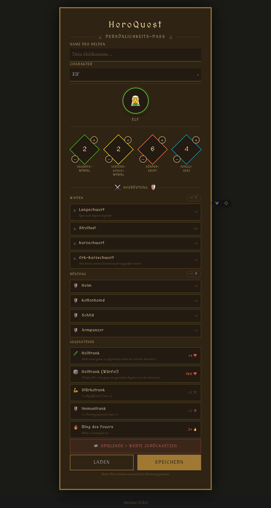
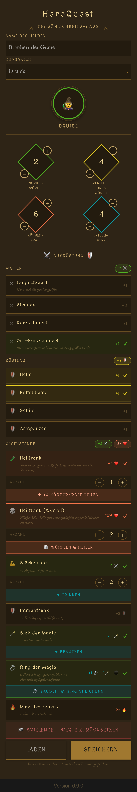

# ⚔️ HeroQuest — Persönlichkeits-Pass

> **Note:** The user interface of this app is entirely in **German**, as it is designed for the German edition of the HeroQuest board game.

A mobile-friendly digital character sheet (*Persönlichkeits-Pass*) for the classic fantasy board game **HeroQuest**. Built with Vue 3, Vite, TypeScript, Pinia, and Tailwind CSS.

---

## Screenshots

<table>
  <tr>
    <td align="center"><strong>Light mode – empty</strong></td>
    <td align="center"><strong>Dark mode – empty</strong></td>
  </tr>
  <tr>
    <td></td>
    <td></td>
  </tr>
</table>

<table>
  <tr>
    <td align="center"><strong>Elf – full equipment list</strong></td>
  </tr>
  <tr>
    <td></td>
  </tr>
</table>

<table>
  <tr>
    <td align="center"><strong>Druide – equipped & items in use</strong></td>
  </tr>
  <tr>
    <td></td>
  </tr>
</table>

---

## About the App

This web app lets HeroQuest players manage their hero's character sheet directly in the browser — no paper required. It covers all the essential information a hero needs during a quest:

- **Hero name & character class** — choose from Barbar, Barde, Druide, Elf, Ritter, Zwerg, or Zauberer
- **Core stats** — Attack Dice (*Angriffswürfel*), Defense Dice (*Verteidigungswürfel*), Body Strength (*Körperkraft*), and Intelligence (*Intelligenz*) are pre-filled with class defaults and can be adjusted with the ＋/− buttons
- **Equipment** — equip weapons and armor; bonuses are calculated automatically and reflected in the displayed stats
- **Gegenstände (items)** — equip consumables and magic items; each item shows its ability and bonus label at a glance:
  - 🧪 **Heiltrank** — always restores exactly +4 *Körperkraft* (never above the starting value)
  - 🎲 **Heiltrank (Würfel)** — roll 1d6 and heal exactly that amount (never above the starting value)
  - 💪 **Stärketrank** — +2 *Angriffswürfel* (max. 6)
  - 🛡️ **Immuntrank** — +2 *Verteidigungswürfel* (max. 6)
  - 🔥 **Ring des Feuers** — deflects 2 fire spells; charges are tracked individually
  - 🪄 **Stab der Magie** *(Druide / Zauberer)* — cast twice in a row
  - 💍 **Ring der Magie** *(Druide / Zauberer)* — store a spell on the 1st use, fire it on the 2nd
  - 📿 **Amulett der Weisheit** *(Barbar)* — passive +1 Intelligence
- **Item quantities** — stackable consumables (potions) have an adjustable quantity counter so you can carry multiple doses
- **Item charges** — multi-use items (Ring des Feuers, Ring der Magie) track remaining charges with a per-use button
- **Death overlay** — when *Körperkraft* reaches 0 a full-screen overlay appears with a configurable revival point selector (capped at the hero's starting *Körperkraft*)
- **End-of-game reset** — the *🏁 Spielende – Werte zurücksetzen* button restores all core stats to their class defaults while retaining all equipment and items
- **Persistent state** — all data is automatically saved in the browser via `localStorage`; nothing is lost on a page refresh
- **Save & Load** — export the complete character sheet as a `.json` file and reload it at any time (or share it with other players)
- **Light & Dark mode** — the UI adapts to the system colour scheme

---

## Characters & Stats

| Character | Avatar | Attack Dice | Defense Dice | Body Strength | Intelligence |
|-----------|:------:|:-----------:|:------------:|:-------------:|:------------:|
| Barbar    | ⚔️    | 3           | 2            | 8             | 2            |
| Barde     | 📯    | 2           | 2            | 5             | 4            |
| Druide    | 🧙    | 1           | 2            | 6             | 4            |
| Elf       | 🧝‍♂️   | 2           | 2            | 6             | 4            |
| Ritter    | 🏰    | 2           | 3            | 7             | 2            |
| Zwerg     | ⚒️    | 2           | 2            | 7             | 3            |
| Zauberer  | 🪄    | 1           | 2            | 4             | 6            |

> Weapon, armor, and passive item bonuses are applied on top of these base values automatically.

---

## Equipment Reference

### Waffen (Weapons)

| Weapon           | Bonus | Restriction       | Note                                           |
|------------------|:-----:|-------------------|------------------------------------------------|
| Breitschwert     | +2    | Barbar only       |                                                |
| Langschwert      | +1    | —                 | Can also attack diagonally                     |
| Streitaxt        | +2    | —                 |                                                |
| Kurzschwert      | +1    | —                 |                                                |
| Ork-Kurzschwert  | +1    | —                 | Orcs can be attacked twice in a row            |

### Rüstung (Armor)

| Armor          | Bonus | Restriction  |
|----------------|:-----:|--------------|
| Helm           | +1    | —            |
| Plattenrüstung | +2    | Barbar only  |
| Kettenhemd     | +1    | —            |
| Schild         | +1    | —            |
| Armpanzer      | +1    | —            |

### Gegenstände (Special Items)

| Item                | Symbol | Kind              | Effect                                           | Restriction         |
|---------------------|:------:|-------------------|--------------------------------------------------|---------------------|
| Heiltrank           | 🧪    | Consumable        | +4 *Körperkraft* (never above starting value)    | —                   |
| Heiltrank (Würfel)  | 🎲    | Consumable        | Roll 1d6 → heal that amount (never above start)  | —                   |
| Stärketrank         | 💪    | Consumable        | +2 *Angriffswürfel* (max. 6)                     | —                   |
| Immuntrank          | 🛡️   | Consumable        | +2 *Verteidigungswürfel* (max. 6)                | —                   |
| Ring des Feuers     | 🔥    | 2-charge item     | Deflects 2 fire spells                           | —                   |
| Stab der Magie      | 🪄    | Passive           | Cast twice in a row                              | Druide, Zauberer    |
| Ring der Magie      | 💍    | 2-charge item     | Store spell (1st use) → fire spell (2nd use)     | Druide, Zauberer    |
| Amulett der Weisheit| 📿   | Passive (+1 INT)  | Permanently +1 Intelligence                      | Barbar              |

---

## Tech Stack

| Layer       | Technology                                                        |
|-------------|-------------------------------------------------------------------|
| Framework   | [Vue 3](https://vuejs.org/) (Composition API)                     |
| Build tool  | [Vite](https://vite.dev/)                                         |
| Language    | TypeScript                                                        |
| State       | [Pinia](https://pinia.vuejs.org/) with `pinia-plugin-persistedstate` |
| Styling     | [Tailwind CSS](https://tailwindcss.com/) + scoped CSS variables   |
| Unit tests  | [Vitest](https://vitest.dev/)                                     |
| E2E tests   | [Playwright](https://playwright.dev/)                             |

---

## Project Setup

```sh
npm install
```

### Development server

```sh
npm run dev
```

### Type-check, compile and minify for production

```sh
npm run build
```

### Run unit tests

```sh
npm run test:unit
```

### Run end-to-end tests

```sh
# Install browsers (first time only)
npx playwright install

# Build first when running on CI
npm run build

# Run all e2e tests
npm run test:e2e

# Run only on Chromium
npm run test:e2e -- --project=chromium
```

### Lint

```sh
npm run lint
```

---

## Project Structure

```
src/
├── components/
│   ├── SkillSheetHeader.vue       # App title and ornament bar
│   ├── SkillSheetHeroFields.vue   # Hero name + character class selector
│   ├── SkillSheetAvatar.vue       # Character avatar / icon display
│   ├── SkillSheetStats.vue        # The four diamond-shaped stat fields + death overlay
│   └── SkillSheetEquipment.vue    # Weapons, armor, and special items (with quantities & charges)
├── data/
│   └── skillSheetData.ts          # All game data (characters, items, stats)
├── stores/
│   └── skillSheet.ts              # Pinia store with persistence
├── views/
│   └── SkillSheet.vue             # Main page view (save/load/end-game logic)
└── router/
    └── index.ts                   # Vue Router setup
```

---

## Save File Format

The exported `.json` file contains the complete character state and can be re-imported at any time:

```json
{
  "name": "Thorin",
  "character": "Zwerg",
  "attackDice": 2,
  "defenseDice": 2,
  "bodyStrength": 7,
  "intelligence": 3,
  "equippedWeapon": ["kurzschwert"],
  "equippedArmor": ["helm", "schild"],
  "equippedSpecialItems": ["heiltrank", "ring-des-feuers"],
  "usedSpecialItems": [],
  "itemQuantities": {
    "heiltrank": 3
  },
  "itemChargesUsed": {
    "ring-des-feuers": 1
  }
}
```

| Field               | Description                                                       |
|---------------------|-------------------------------------------------------------------|
| `name`              | Hero name entered by the player                                   |
| `character`         | Selected character class                                          |
| `attackDice`        | Current attack dice value (base + weapon bonus)                   |
| `defenseDice`       | Current defense dice value (base + armor bonus)                   |
| `bodyStrength`      | Current body strength (reduced during combat)                     |
| `intelligence`      | Current intelligence (may include passive item bonuses)           |
| `equippedWeapon`    | List of equipped weapon IDs                                       |
| `equippedArmor`     | List of equipped armor IDs                                        |
| `equippedSpecialItems` | List of equipped special item IDs                              |
| `usedSpecialItems`  | IDs of items that have been fully consumed / used                 |
| `itemQuantities`    | Number of doses/copies owned per item ID                          |
| `itemChargesUsed`   | Number of charges spent per multi-use item ID                     |
